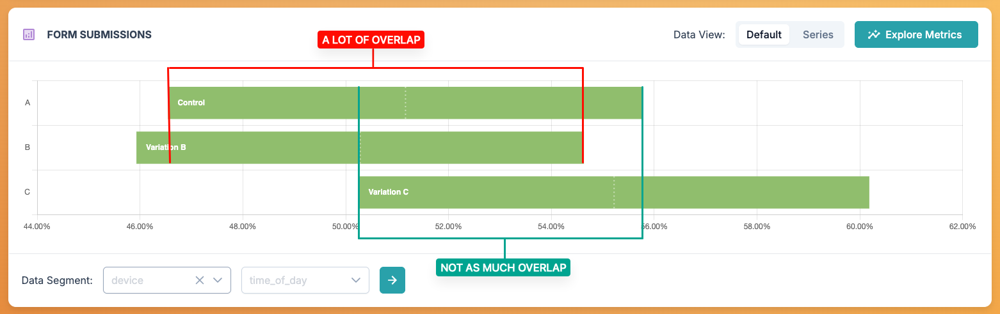

# Analyzing Data

This is a guide on how to analyze the split test result data in the Splitty Test dashboard.

## Understanding Split Test Results

When running a split test, there are a few things you should keep in mind...

* Small data is often inaccurate&mdash;let every test run its course. Don't make a decision too early because things look really good or really bad.
* Big changes are better, small changes may not move the needle enough to help you make a decision. Better assumptions can be made from a big loss or a big win.
* Sometimes the results don't make sense. Trust the data, but always be weary of bugs.

When you view the details of your split test, you'll see a chart with a horizontal bar for each active variation and a table with raw data below it. This chart is a quick way to help you understand how each variation is performing in relation to each other. Think of those bars as the top down view of a distribution curve. The center of the bar is the mean value and the start and end of the bar represent the positive and negative deviation from that mean. The further those bars are away from each other, the more significant the result is. If two bars have a lot of overlap, there isn't enough data to tell if one performs much better than the other. When the bar have diverged enough to meet the confidence interval requirement you've set for the test, the colors of the bars will change.

### Data Smoothing

When a test first starts, small amounts of data can make the results (specifically the charts) look very erratic. This might cause a tester to  stop a test or make a decision too soon. If we have a general idea of what the typical outcome for the data we are testing is, we can input some values to help us "smooth" that data quite a bit. This allows us to see data slowly diverge over time instead of jumping around.

## What is Confidence?

A confidence interval describes the percentage of confidence there is that a variation is out-performing another. So a confidence interval of 70% would assume there is a 30% chance the variation performance you are seeing in the results is not actually better. The higher the confidence interval, the more confident you can be that the data you are seeing can help you make the right decision. A higher confidence interval typically requires more data to reach.

The confidence interval you set on your test will determine when a variation is marked with "confidence" in the data table for standard tests, or when a variation is switched to "exporation" mode for auto-optimized tests.